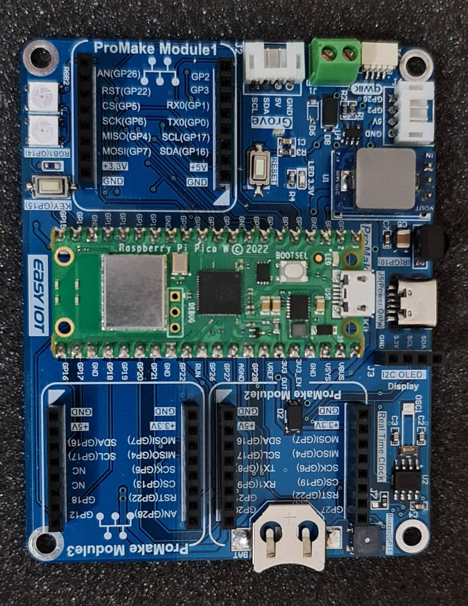
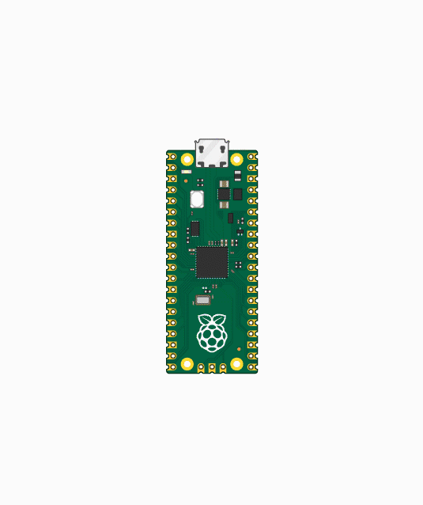
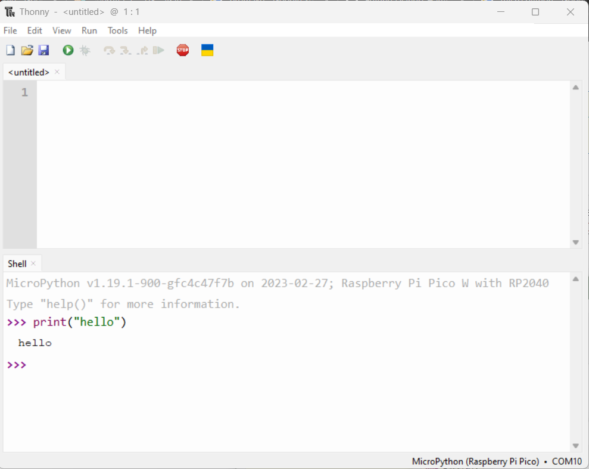
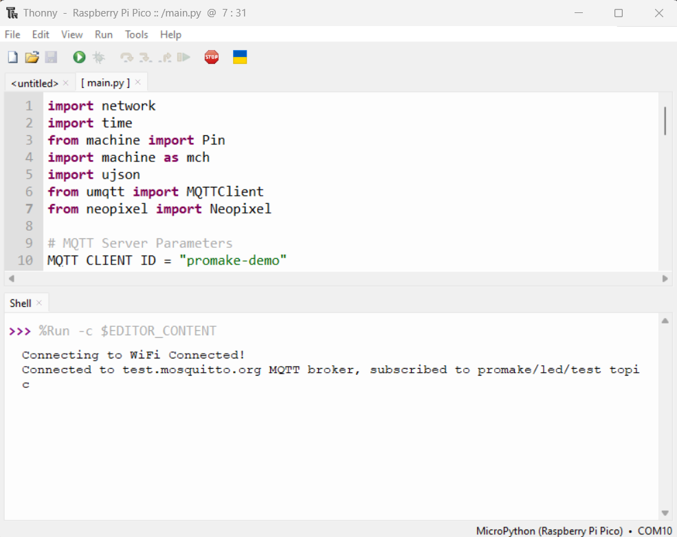

<h1 align="center">MicroPython ProMake Rasp Pico LED VoiceControl</h1>


<div align="center" ><a href="https://easy-iot.ir"></a></div>

<h3 align="center">Brief Sample to control raspberry pico w with google voice assistant (SpeechRecognition) through mqtt</h3>
<p align="center">
<a href="https://www.micropython.org/" target="_blank">  </a> 
<a href="https://www.easy-iot.ir/" target="_blank">  </a> 
<a href="https://gigapardaz.com/" target="_blank">  </a> 
<a href="https://www.raspberrypi.com/" target="_blank">  </a> 
</p>

### Overview
- [Features](#features)
- [Assemble](#assemble)
- [Setup PicoW](#setup-picow)
- [Setup Thonny](#setup-thonny)
- [Upload the code](#upload-the-code)
- [Assistant](#assistant)
  - [Setup Code](#setup-code)
  - [Test Code](#test-code)
- [License](#license)
- [Bugs or Opinion](#bugs-or-opinion)


# Features
- MicroPython
- NeoPixel
- uMqtt
- Raspberry Pico W


# Assemble
There is no special setup required cause the board already has what you need but if you considered using the built in led then go ahead and change the code accordingly.
<div align="center" ></div>


# Setup PicoW
In order to program the raspberry pico W you need to flash the microPython to the board. there are several ways to do that but this is the shortest way.
first of all download the required flash file from the link below (download the latest version):

- <https://micropython.org/download/rp2-pico-w/>

then bring the board to the flash mode, hold down the BOOTSEL button while plugging the board into USB.

<div align="center" ></div>

Then copy the uf2 file to the USB mass storage device that appears. Once programming of the new firmware is complete the device will automatically reset and be ready for use.

# Setup Thonny
you can install thonny on your os by following the instructions provided in the link below:

- <https://thonny.org/>

**Note:** if you already have python 3.8 and above installed, the easiest way is to use ```pip install thonny --upgrade```

after installation open thonny and choose the right board from the selector in the bottom right corner of the application.

<div align="center" ></div>

in case you want to test just see if you have the right output on the terminal.

# Upload the code
before running the code, change the variables according to your need.
```python
# MQTT Server Parameters
MQTT_CLIENT_ID = "promake-demo"
MQTT_BROKER    = "test.mosquitto.org"
MQTT_USER      = ""
MQTT_PASSWORD  = ""
MQTT_TOPIC     = "promake/led/test"

# WiFi Credentials
WIFI_SSID = "SSID"
WIFI_PASSWORD = "PASSWORD"
```

open each code inside ```src``` directory and save to the board except the main, in this case it will be considered as modules to work with.
after that just open the main and run it inside thonny.
it will start running and trying to connect to the wifi you provided. and the connect to the mqtt broker.
<div align="center" ></div>


# Assistant

## Setup Code
first of all you have to install the dependencies so go to the assistant directory and use the requirements.txt and install the dependencies with the command bellow:

```shell
pip install -r requirements.txt
```

after that all you have to do is run the ```google_assistant.py``` code.
**Note:** dont forget to setup your microphone and choose the right index.

## Test Code
now each time you want the assistant to listen to the incoming voice you have to raise it with the combination of ``` Ctrl+` ```then you will see the message telling you that its ready and listening.
```shell
say something...
```

now there are two keywords which the code is listening to:

- روشن
- خاموش
- آبی
- قرمز 
- سبز
- زرد
- نارنجی

which means in order to set the light on you have to say the first  keyword, then a message will be published through mqtt to the corresponding subscriber and the raspberry will change the led state to On. and if you say the second keyword it will be otherwise.

# License
MIT

# Bugs or Opinion
Feel free to let me know if there are any problems or any request you have for this repo.
